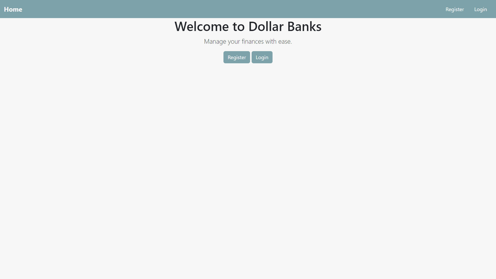
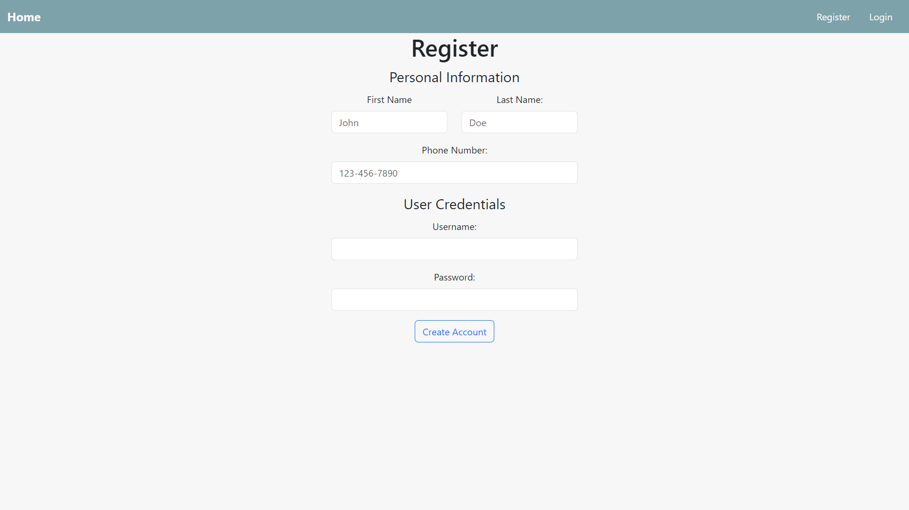
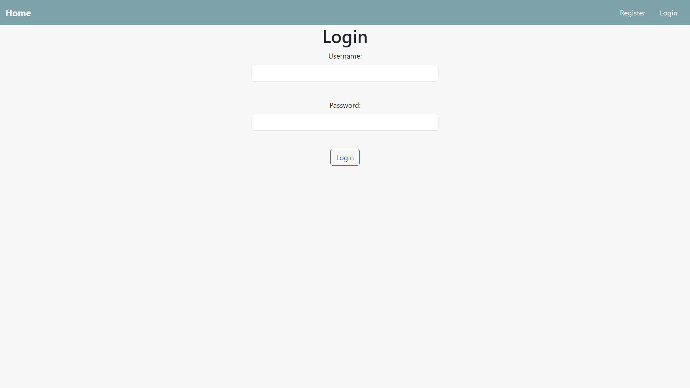
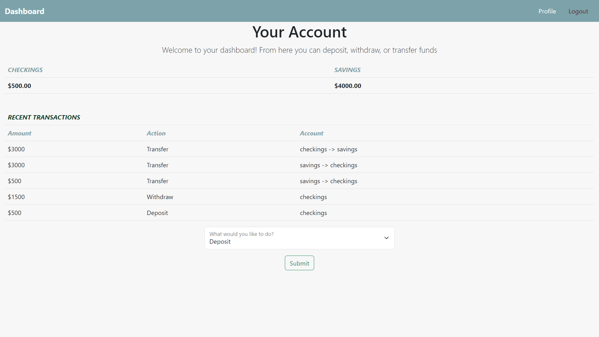
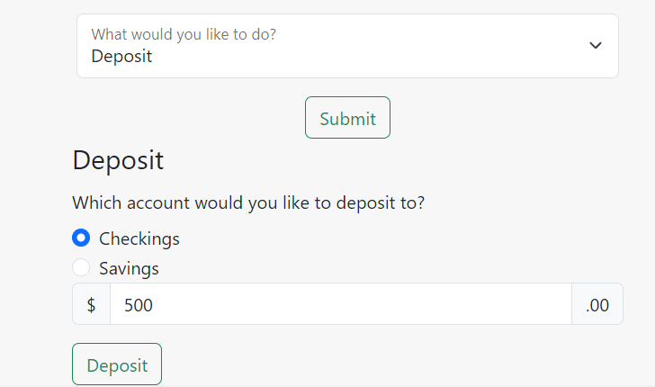
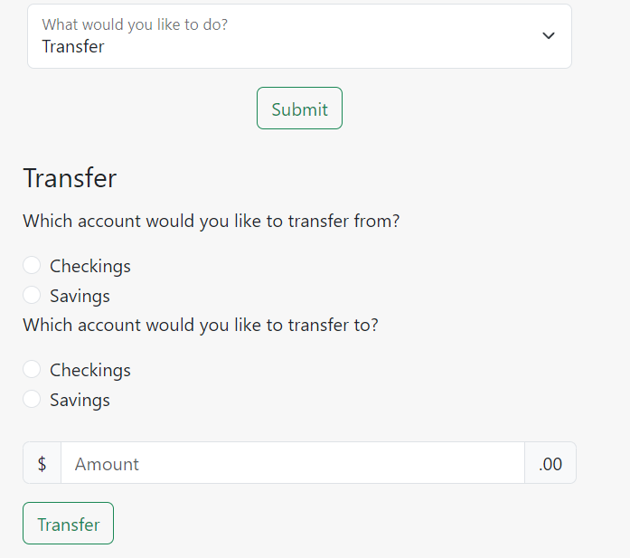
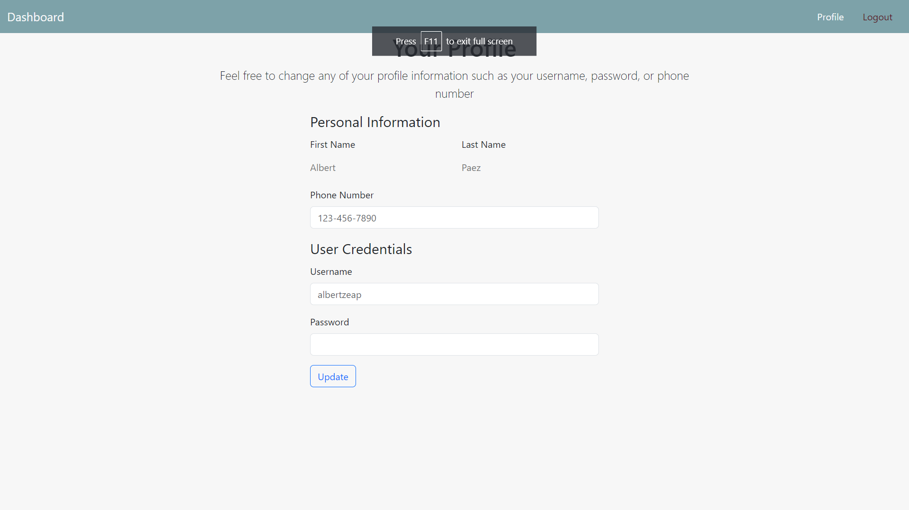

# DollarsBankFE

## Overview

A simple JavaScript, HTML, and CSS website that acts a banking application where users can:
1. Register for an account
2. Login to an existing account
3. View current checkings and savings balance
4. View transaction history
5. Deposit funds
6. Withdraw funds
7. Transfer funds
8. Change profile details such as username, password, and phone number

## Table of Contents

- [Installation](#installation)
- [Screenshots](#screenshots)

## Installation

Step-by-step instructions on how to set up the project locally. Include any prerequisites, dependencies, or configuration steps necessary to get the project running.  
`$ git clone https://github.com/albertzeap/DollarsBankFE.git`   
`$ cd DollarsBanksFE`  
`$ npm install`  
`$ npm start`  

In a separate terminal follow these steps to start the backend server which runs off JSON-server  
`$ cd DollarsBanksFE/backend`  
`$ json-server --watch db.json`

## Screenshots

### Home Page

### Register & Login Page

### Dashboard

### Deposit & Transfer

### Profile

